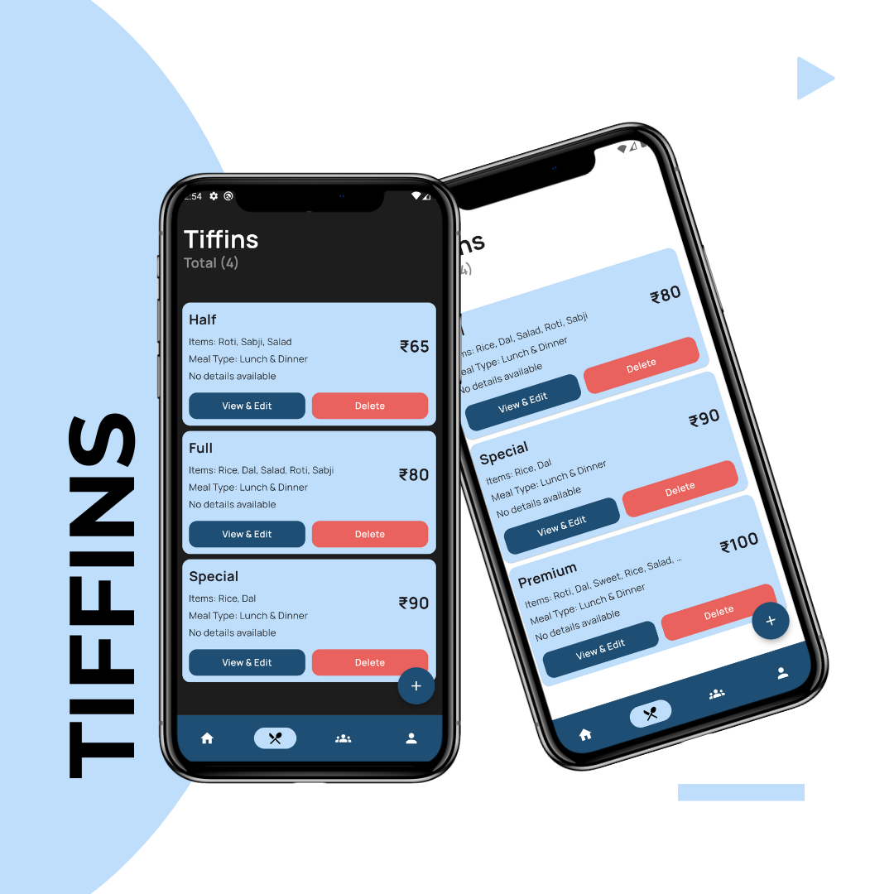
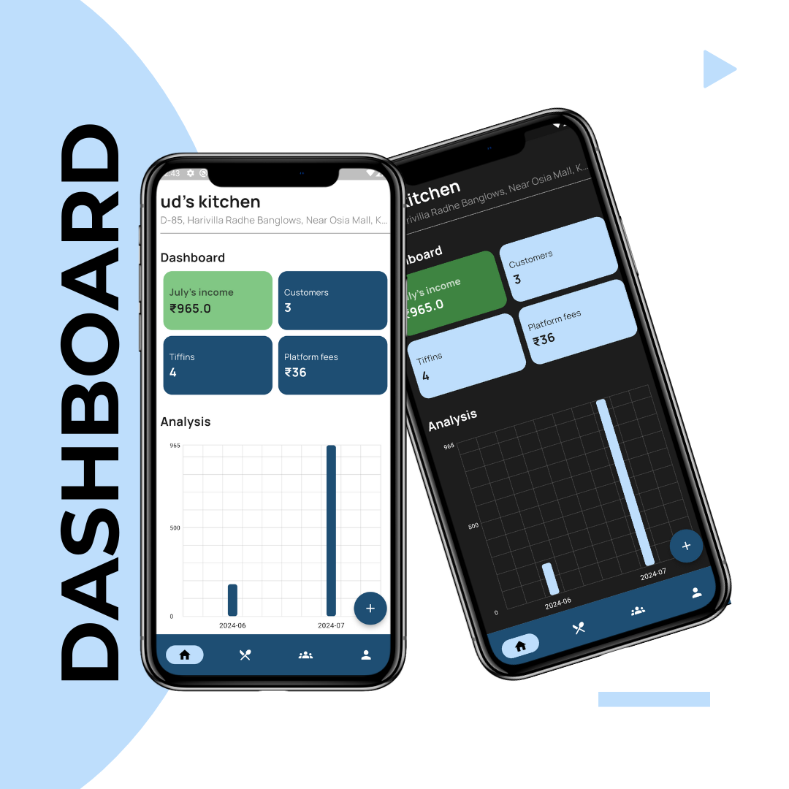
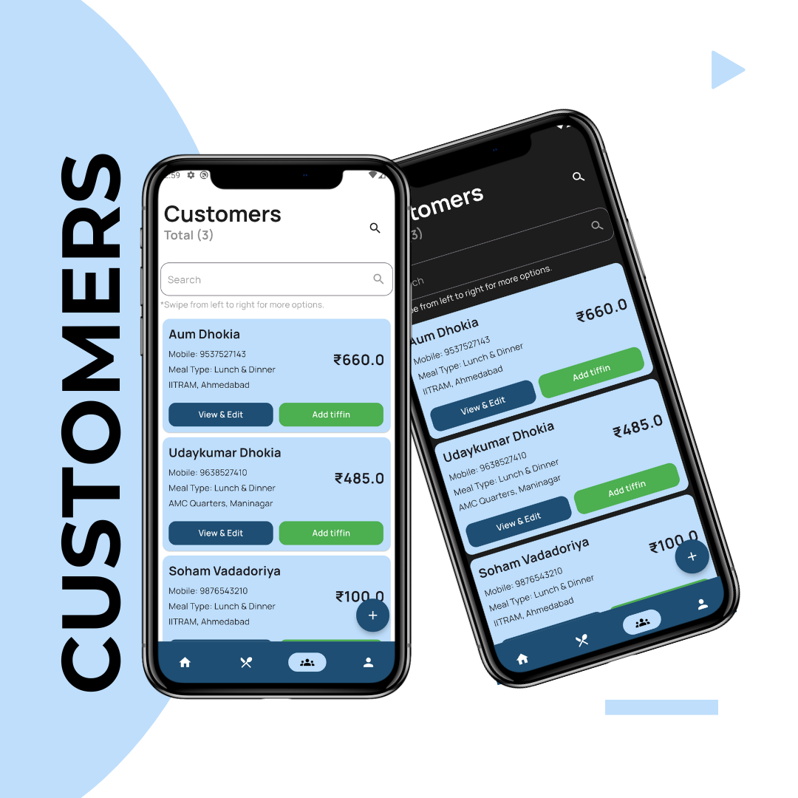
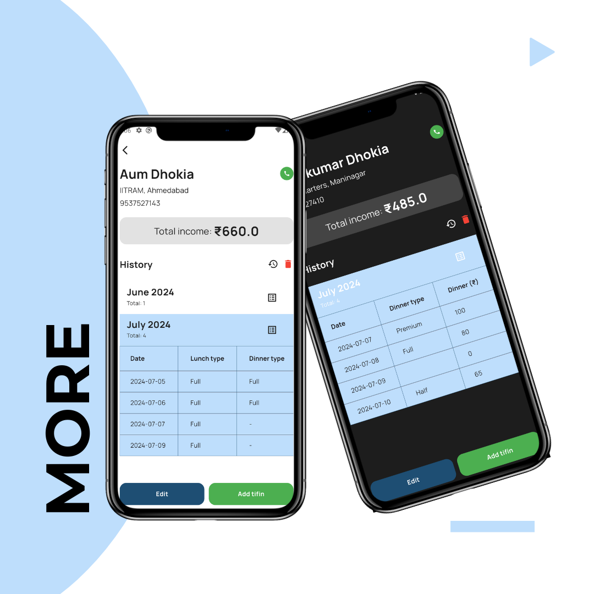

# Tiffin Management System

[](https://flutter.dev)
[](https://flutter.dev/docs/deployment)
[](LICENSE)

Welcome to the **Tiffin Management System**, the ultimate tool for tiffin service providers! This app is designed to simplify and streamline your business operations, helping you provide an efficient and organized tiffin service to your clients. Made with Flutter, this app offers cross-platform functionality on Android, iOS, and Web, ensuring easy access for both you and your customers.

## Features

- **Customer Management**: Add, edit, and manage customer profiles, preferences, and order details with ease.
- **Automated Billing**: Generate monthly bills based on customer orders and send reminders for payments.
- **Analytics & Reports**: Visualize your data with charts to analyze sales trends, customer satisfaction, and performance.
- **User Authentication**: Secure login and registration for both providers and customers.

## Tech Stack

- **Flutter**: Cross-platform framework for building a responsive UI for Android, iOS, and Web.
- **Firebase**: For authentication, real-time database, and cloud storage.
- **Google Fonts**: Provides attractive typography for the app.

## Installation

### Prerequisites

- Flutter SDK: [Install Flutter](https://flutter.dev/docs/get-started/install)
- Firebase Project: [Set up Firebase](https://firebase.google.com/)

### Steps

1. Clone the repository:
   ```bash
   git clone https://github.com/udaykumar-dhokia/tiffin-management-system.git
   cd tiffin
   ```

2. Install dependencies:
   ```bash
   flutter pub get
   ```

3. Set up Firebase:
   - Create a Firebase project.
   - Add Android, iOS, and Web configurations to your Firebase project.
   - Download the `google-services.json` and `GoogleService-Info.plist` files and add them to your project.

4. Run the app:
   ```bash
   flutter run
   ```

## Screenshots

| Feature          | Screenshot                                                 |
|------------------|------------------------------------------------------------|
| **Tiffins**      |                           |
| **Dashboard**    |                     |
| **Customers**    |                |
| **Billing**      |                         |

## Usage

- **Login** as a service provider to access the main dashboard.
- **Manage Customers** by adding new profiles and updating existing ones.
- **Track Orders** daily and generate monthly records automatically.
- **Send Notifications** to customers about tiffin details, order updates, and billing.
- **View Analytics** to assess monthly performance and adjust service accordingly.

## Contributing

Contributions are welcome! To contribute:

1. Fork the repository.
2. Create a new branch (`feature/your-feature`).
3. Make your changes.
4. Submit a pull request.

## License

This project is licensed under the MIT License - see the [LICENSE](LICENSE) file for details.

## Contact

For questions or suggestions, please feel free to reach out:
- GitHub: [@udaykumar-dhokia](https://github.com/udaykumar-dhokia)
- LinkedIn: [Udaykumar Dhokia](https://www.linkedin.com/in/udaykumar-dhokia)
